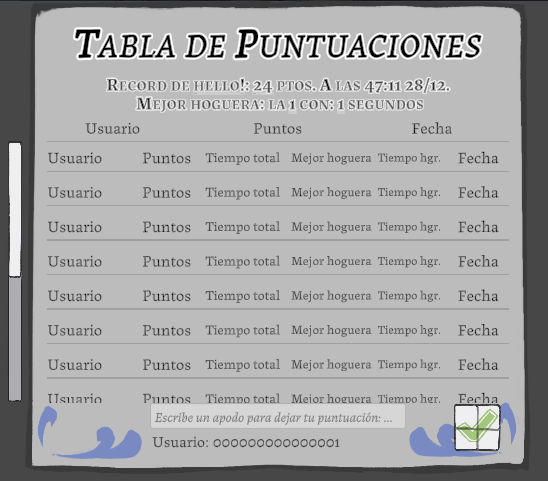

### A set of scripts and utilities to manage multiple leaderboards generated by Dan's Leaderboard Creator.

Originally made for [La LLama de Sant Antoni](https://richardotomislav.itch.io/la-llama-de-sant-antoni) to learn leaderboard management and server communication in Unity.

This developed to using Dan's Leaderboard's, as I wasn't experienced enough with server communication to make my own. For that I'm very grateful to Dan for providing this tool free to use.

### Table of Contents

- [Setup](#setup)
- [Basic Usage](#basic-usage)
  - [Using LeaderboardCreator](#using-leaderboardcreator)
  - [Creating LeaderboardSettings](#creating-leaderboardsettings)
  - [Adding a Leaderboard prefab and intializing it](#adding-a-leaderboard-prefab-and-intializing-it)
    - [How it works](#how-it-works)
- [Customizing the prefab's appearance](#customizing-the-prefabs-appearance)

## Setup

1. Import the latest `.unitypackage` from <https://github.com/danqzq/unity-leaderboard-creator/releases>. *Import the package **WITHOUT** demo assets.*

2. Import the LeaderboardManager `.unitypackage` from <https://github.com/richardotomislav/leaderboardmanager/releases/latest>.

    Alternatives:

    a. Clone this repository directly into your Unity project's `Assets` folder.

    b. Or download the repo source code as a .zip and extract directly to the `Assets` folder.

## Basic Usage

> [!WARNING]
> Make sure to have imported the latest version of the Leaderboard Creator package.\
> If not, you will **NOT** be able to use the manager.

### Using LeaderboardCreator
First of, you need to create a leaderboard at <https://danqzq.itch.io/leaderboard-creator>.
After this, return back to Unity, and in the window's toolbar:

`LeaderboardCreator -> My Leaderboards`

After that, add as many leaderboards as you need.
**IMPORTANT**: Click `Save to C# Script` so the next step can be achieved.
### Creating LeaderboardSettings
`Create -> Leaderboards -> Settings`

This will create a "settings" scriptable object that automatically gets any leaderboard saved in `Leaderboards.cs` from the Leaderboard Creator.

### Adding a Leaderboard prefab and intializing it
Add a new leaderboard from `Prefabs -> LeaderboardPrefabs -> Leaderboard` to your scene (as a child of a canvas).

Then, in your script, intialize the leaderboard with the following code:

```csharp
[SerializeField] private LeaderboardManager leaderboardNoExtra;
[SerializeField] private LeaderboardManager leaderboardWithExtra;

[SerializeField] private string testLeaderboardName = "DemoSceneLeaderboard";
[SerializeField] private int testScore = 100;
[SerializeField] private string testExtra = "TestExtra";

void LoadLeaderboards()
{
    // Initialize the leaderboard with test data
    leaderboardNoExtra.InitializeLeaderboard("Test", 200);
    Debug.Log($"Initialized leaderboard: Test with score: 200");

    leaderboardWithExtra.InitializeLeaderboard(
        "DemoSceneLeaderboard",
        100,
        "TestExtra"
    );
    Debug.Log($"Initialized leaderboard: {testLeaderboardName} " +
              $"with score: {testScore} and {testExtra}");
}
```

`InitializeLeaderboard()` has an optional parameter called extra, which can be used to store other types of data.

#### How it works

As a limitation, the first parameter of `InitializeLeaderboard()` is a string which corresponds to the `Name` set on the Leaderboard Creator window, and then transfered to `Settings` Scriptable Object.

This is done this way to be able to dynamically manage multiple leaderboards in the same scene.

> [!NOTE]
> I accept any suggestions to improve this system.\
> For the original purpose of this project, I used dictionaries and handler intialization.

## Customizing the prefab's appearance
The prefab is done to be as modifible as possible.

Here's my leaderboard customized to fit my game:


